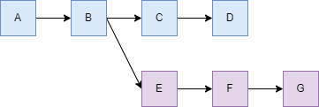
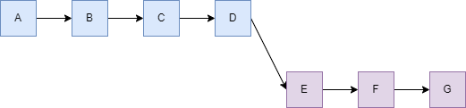
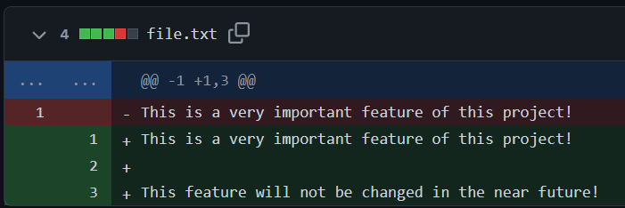
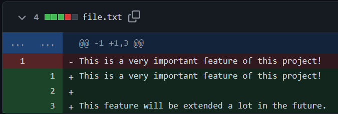
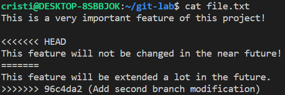

# Laboratorul 04: Git & Github

## Version Control

Un sistem pentru controlul versiuni este un sistem care înregistrează modificările suferite de un fișier sau un grup de fișiere în decursul timpului pentru a facilita revenirea la o versiune specifică ulterior.

Exista 3 tipuri de sisteme pentru controlul versiunii:

### Sisteme locale pentru controlul versiunii

Cele mai vechi VCS-uri (VCS – Version Control System) au presupus că toți dezvoltatorii lucrau în propriile directoare pe un singur sistem de fișiere partajat. Repository-ul a fost păstrat într-un director separat (adesea ascuns).
A face check out si a trimite commit-uri se rezolva prin operații obișnuite cu fișiere, precum copieri și redenumiri.

### Sisteme centralizate pentru controlul versiunii

Sistemele locale pentru controlul versiunii au oferit o soluție pentru gestiunea versiunii pentru aplicații dezvoltate de o singură persoană pe un anume sistem.
Din păcate această soluție nu vine în ajutorul persoanelor ce trebuie să colaboreze cu alți dezvoltatori și să interacționeze cu alte sisteme.
Pentru a rezolva și această problemă sistemele centralizate pentru controlul versiunii (CVCS – Centralized Version Control Systems) au fost dezvoltate.

Sistemele centralizate pentru controlul versiunii (CVCS – Centralized Version Control Systems) (precum CVS, Subversion, Perforce etc) au repository-ul pe un singur server, conectat la retea.
Pentru a face check out, fisierele trebuiesc transferate din server în directorul de lucru.

Aceasta soluție oferă numeroase avantaje comparativ cu sistemele locale pentru controlul versiunii: toată lumea știe până la un anumit nivel ce fac restul colaboratorilor în cadrul proiectului;
administratorii au la dispoziție o manieră eficientă de a gestiona accesul la resurse și este mult mai ușor de gestionat o bază de date centrală decât una locală pentru fiecare utilizator.

O problemă evidentă este legată de disponibilitatea nodului central: dacă acesta întâmpină orice fel de problemă o să împiedice orice acțiune din partea utilizatorilor până problema va fi rezolvată.
În plus fiind singurul sistem care conține toate stările fișierelor din cadrul unui proiect, în cazul în care aceste date sunt pierdute recuperarea acestora este de foarte multe ori imposibilă.

### Sisteme distribuite pentru controlul versiunii

Dezavantajele și riscurile create de un sistem centralizat pentru controlul versiunii a condus la apariția sistemelor distribuite pentru controlul versiunii (Distributed Version Control Systems – DVCS)(precum Git, Mercurial, Bazaar, Darcs etc), în cadrul acestora utilizatorii nu obțin doar ultima versiune a fișierelor, ci propria copie a repository-ului cu toate versiunile noi și vechi ale proiectului.
Diferitele repository-uri se sincronizează între ele periodic pe rețea.

Un avantaj este că această abordare adaugă robustețe.
În modelele locale și centralizate, un repository corupt sau un hard disk eșuat poate duce la pierderea tuturor datelor.
În modelul distribuit, vă puteți recupera adesea din astfel de accidentări, deoarece mai mulți dezvoltatori își pot uni repository-le pentru a recupera întregul istoric al proiectului.
Majoritatea echipelor care lucrează cu VCS distribuite vor desemna în continuare un repository ca origine centrală a copiilor lor, pur și simplu pentru că acest lucru simplifică comunicarea în echipă.

## Avantajele sistemelor de versionare

Care sunt avantajele folosirii unui sistem de versionare? este salvat istoricul tuturor modificărilor, astfel că se poate reveni oricând la o versiune mai veche dacă se descoperă prin folosirea unui serviciu de hosting, codul sursă are mereu o copie de siguranță online cea mai recentă versiune a codului sursă este mereu disponibilă tuturor dezvoltatorilor, făcând astfel colaborarea și sincronizarea mult mai ușoară decât în cazul trimiterii de fișiere conținând cod sursă dezvoltatorilor interesați de proiect.

## GitHub

GitHub este o platformă online, pe care dezvoltatorii o pot folosi pentru a stoca și versiona codul lor sursă.
Git este un sistem de management și versionare a codului sursă care permite lucrul eficient la un proiect software.
Astfel, Git este utilitarul folosit în terminal, iar GitHub este serverul și aplicația web pe care rulează acesta, locul în care păstrăm repository-ul remote.

### Pregătirea inițială a mediului Git

```
$ git config --global user.name "Prenume Nume"
$ git config --global user.email "adresa_de_email@example.com"
$ git config --list
```
### Crearea unui fork al unui repository

Notiunea de `fork` nu este specifica git-ului, ci platformelor care stocheaza repository-uri, precum Github si Gitlab.
Fork reprezinta o copie a unui repository, unde creatorul fork-ului poate face modificari, chiar daca nu are drepturi de a modifica repository-ul original.
Pentru a crea un fork al unui repository stocat pe Github, navigati pe pagina repository-ului, apoi apasati butonul "Fork" din dreapta sus.

### Clonarea unui repository

```
$ git clone <url_repository>
```

### Remote, origin and upstream

Termenul de `remote` se refera la locatia unde este stocat un repository, pe un server de git.
La clonarea unui repository de pe Github, este adaugat in mod automat un remote, numit `origin`.
In cazul unui repository obtinut dintr-un fork, `origin` va fi reprezentat de locatia fork-ului.
Orice modificare la repository-ul original nu se va vedea automat si in copie.
Pentru a putea sincroniza cele 2 repository-uri, se foloseste un alt `remote`, numit de obicei `upstream`.

Pentru a adauga un `remote` numit `upstream`, se poate folosi comanda urmatoare, in folder-ul unui repository:
```
$ git remote add upstream <url_repository_original>
```

### Sincronizare

Pentru a aduce modificarile dintr-un repository remote intr-unul local, se foloseste comanda.
```
$ git pull
```

In cazul in care pe repository-ul local este activ un `branch`, comanda de mai sus va sincroniza branch-ul local cu cel remote.

Exista situatii in care, fiind pe un branch copil, pornit dintr-un branch parinte (ex. `main`), dorim sa integram modificarile din parinte in branch-ul nostru.
Aici intervine notiunea de `rebase`.



### Rebase

Prin `rebase` se intelege schimbarea bazei unui branch.
Baza unui branch este ultimul commit comun dintre branch-ul copil si branch-ul parinte.

Cea mai simpla metoda de a integra schimbarile dintr-un branch parinte intr-unul copil este prin folosirea comenzii
```
$ git pull --rebase <remote> <nume_parinte>
```

Pentru a aduce schimbarile din branch-ul `main` din `remote`-ul `origin`, comanda devine

```
$ git pull --rebase origin main
```



Dupa rebase, daca dorim sa trimitem modificarile catre remote, folosind comanda
```
$ git push
```
vom observa ca istoricul de commit-uri nu este cum ne-am astepta.
TODO: diagrama push dupa rebase

Pentru a avea un istoric curat, e nevoie se folosim comanda
```
$ git push --force
```

Aceasta varianta de `push` va forta suprascrierea istoricului de pe remote cu cel de pe local.

### Stashing

Varianta de mai sus functioneaza doar daca schimbarile locale sunt sub forma unui commit.
In cazul in care exista fisiere modificate, dar care nu au fost adaugate intr-un commit, comanda de `pull` va esua.
Pentru asta exista 2 solutii:
1. Crearea unui commit - nu este intodeauna de dorit (nu este finalizat ce vrem sa adaugam)
2. Folosirea functionalitatii de `stash`

`Stash` ne permite sa salvam modificarile care nu fac parte dintr-un commit.

Pentru a salva toate modificarile dintr-ul repository, se foloseste comanda
```
$ git stash push *
```

Pentru a salva doar un fisier, se foloseste comanda
```
$ git stash push <fisier>
```

Restaurarea modificarilor salvate se face cu comanda
```
$ git stash pop
```

Deoarece acest mecanism functioneaza ca o stiva, comanda de `pop` va restaura doar fisierele salvate de ultima comanda de `push`.

### Merge conflict

De multe ori, o operatie de `rebase` sau de `stash pop` va duce la un `merge conflict`.
Acesta apare deoarece ultimul commit, `HEAD`, si modificarile pe care vrem sa le aplicam difera, iar diferentele nu apar datorita modificarilor noastre (nu fac parte dintr-un `patch`).
Pentru a intelege aceasta situatie, vom urmari un exemplu.

Repository-ul curent contine 2 branch-uri, `feature_branch_1` si `feature_branch_2`.
Initial, pe `feature_branch_1` a fost adaugat fisierul `file.txt`.
Branch-ul `feature_branch_2` a fost creat dupa adaugarea fisierului.
Apoi, pe ambele branch-uri au fost facute modificari asupra fisierului.




Daca se decide integrarea schimbarilor de pe branch-ul 1 pe branch-ul 2, va aparea un merge conflict.
Acesta va fi indicat de git, in fisierele in care se afla conflictele.



Pentru a rezolva un conflict, trebuie urmati urmatorii pasi:
1. Trebuie pastrate una dintre variante, sau ambele, si eliminate delimitatoarele `<<<<<<< HEAD`, `=======` si `>>>>>>> <sha>`, apoi salvat fisierul
2. `$ git add <fisier>`
3. `$ git rebase --continue`, daca merge conflict-ul a aparut in urma unui rebase, sau `git merge --continue`, in cazul unui merge.

### Organizarea istoricului de commit-uri

Cand se adauga un feature nou unui proiect, este bine ca istoricul de commit-uri sa explice schimbarile aduse.
In practica, multi utilizatori realizeaza commit-uri de tipul "Am rezolvat un bug", "Am mai rezolvat un bug".
Commit-urile sub forma asta sunt bune pe procesul de dezvoltare, dar nu si in momentul cand feature-ul este integrat in proiectul mare.
Se prefera urmatoarea forma a commit-urilor: `[componenta majora]: Functionalitate adaugata`.
Orice rezolvare de bug, coding-style sau alte modificari, care fac parte din noua functionalitate, trebuie integrate intr-un singur commit.
Asta nu inseamna ca trebuie facut commitn doar cand totul merge.
Git pune la dispozitie unelte pentru a reface istoricul de commit-uri.

#### Amend

Comanda
```
$ git commit --amend
```
modifica ultimul commit, prin modificarea mesajului commit-ului, sau a schimbarilor din el.
Problema cu aceasta comanda este ca in istoric vor aparea atat commit-ul vechi, cat si cel modificat cu `--amend`.
De aceea, e necesara folosirea lui `$ git push --force`.

#### Rebase interactiv

Comanda
```
$ git rebase -i
```
ne permite sa modificam istoricul mai mult decat `--amend`: ne permite sa facem amend, sa imbinam commit-uri (`squash`), sa stergem commit-uri, sau chiar sa le modificam ordinea.
Comanda mai asteapta si intervalul de commit-uri asupra carora se vor face modificarile.
De obicei, acest interval este dat sub forma `@~N`, care inseamna "ultimele N commit-uri". 

#### Reset

Exista situatii cand este mai simplu sa fie refacut istoricul de commit-uri stergandu-le pe toate si rescriindu-le.
Pentru asta se poate folosi
```
$ git reset <interval>
```
Aceasta comanda sterge commit-urile, dar pastreaza modificarile aduse de acele commit-uri.
Exista varianta
```
$ git reset --hard <interval>
```
care sterge si modificarile aduse fisierelor.

### Bisect

Uneori (de cele mai multe ori) proiectele vor avea bug-uri.
De cele mai multe ori, vom scrie mult cod, multe commit-uri, apoi vom testa ce am scris.
Problema apare cand s-au facut modificari substantiale, si e nevoie sa fie gasit un bug.
In situatiile in care nu se poate observa citind codul, e nevoie sa trecem prin tot istoricul de commit-uri, unul cate unul, sa vedem unde a aparut problema.
Git pune la dispozitie o unealta pentru a simplifica procesul: `git bisect`.
Aceasta comanda face o cautare binara interval de commit-uri definit de utilizator, cautand primul commit "rau".

Pentru a folosi `git bisect`, trebuie urmati urmatorii pasi:
1. `$ git bisect start`
2. `$ git bisect bad` 
3. `$ git checkout <sha_ultimul_commit_bun>`
4. `$ git bisect good`

Dupa aceste comenzi, git va trece prin fiecare commit si va astepta sa fie marcat ca `good` sau `bad`, pana va gasi primul commit `bad` din istoric.

Pentru a reveni la starea de dinainte de `git bisect start`, se foloseste comanda `git bisect reset`.

## Exercitii:

1. Faceti fork repository-ului, cu optiunea de a copia si branch-urile existente.
Clonati repository-ul obtinut.
Adaugati un remote `upstream` catre repository-ul original.
2. Echipa a decis ca nu se vor mai adauga feature-uri in plus.
Faceti schimbarea pe branch-ul `feature_branch_2`, pentru a fi la zi cu modificarile de pe branch-ul `feature_branch_1`.
Pastrati linia cu "big boss". 
Creati un pull-request, din interfata GitHub, catre branch-ul `feature_branch_1` din fork-ul vostru.
Adaugati asistentul de la laborator ca reviewer.

Pentru urmatoarele exercitii, veti lucra pe diferite branch-uri din acest repository, cu un program scris de un intern imaginar, de la o firma imaginara.
Programul trebuie sa citeasca un numar de la tastatura, si sa intoarca valoarea citita adunata cu 5.
Pentru fiecare exercitiu, veti crea un pull request catre branch-ul `main` din fork-ul vostru.

3. Folosind `git commit --amend`, modificati mesajul de commit al ultimului commit de pe branch-ul `amend_branch`.
Nu conteaza in ce modificati mesajul.
4. Pe parcursul dezvoltarii, intern-ul a introdus un bug: numarul citit nu se aduna cu 5.
Folosind `git bisect`, gasiti commit-ul care a introdus bug-ul.
(Nu conteaza daca e evident unde apare, folositi `bisect`).
Adaugati un commit care rezolva problema, pe branch-ul `bisect_branch`.
5. Folosind `git rebase --interactive`, faceti `squash` tuturor commit-urilor de pe branch-ul `rebase_interactive_branch` care nu adauga o functionalitate noua.
6. Folosind `git reset`, eliminati toate commit-urile de pe branch-ul `reset_soft_branch` si creati un singur commit cu intreaga implementare.
7. Manager-ul intern-ului tocmai a zis ce task avea de fapt de facut: sa genereze un numar random in 5 moduri diferite.
Folosind `git reset --hard` Eliminati toate modificarile de pe branch-ul `reset_hard_branch`, si implementati ce i s-a cerut de fapt.
(E o mica provocare sa gasiti a 5-a metoda - nu citire din `/dev/random` sau `rdseed`).

## Feedback

Daca ceva nu a mers, sau ati mai fi dorit sa fie si alte chestii in acest laborator, adaugati un issue.
